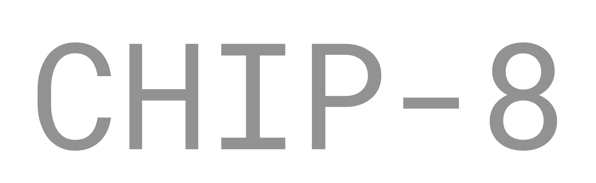
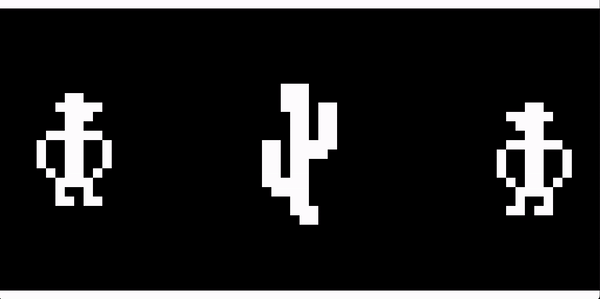

<p align="center" width="100%">
    
</p>

<p align="center" width="100%">
    
</p>


Yet another CHIP-8 interpreter.
### Installation
Requires Python 3.10 and above. 
```
pip install -r requirements.txt
pip install .
```

### Usage
```
chip8 [executale]
```


### Keypad mapping
The following keypad to keyboard mapping is used.

```
Keypad       Keyboard
+-+-+-+-+    +-+-+-+-+
|1|2|3|C|    |1|2|3|4|
+-+-+-+-+    +-+-+-+-+
|4|5|6|D|    |Q|W|E|R|
+-+-+-+-+ => +-+-+-+-+
|7|8|9|E|    |A|S|D|F|
+-+-+-+-+    +-+-+-+-+
|A|0|B|F|    |Z|X|C|V|
+-+-+-+-+    +-+-+-+-+
```